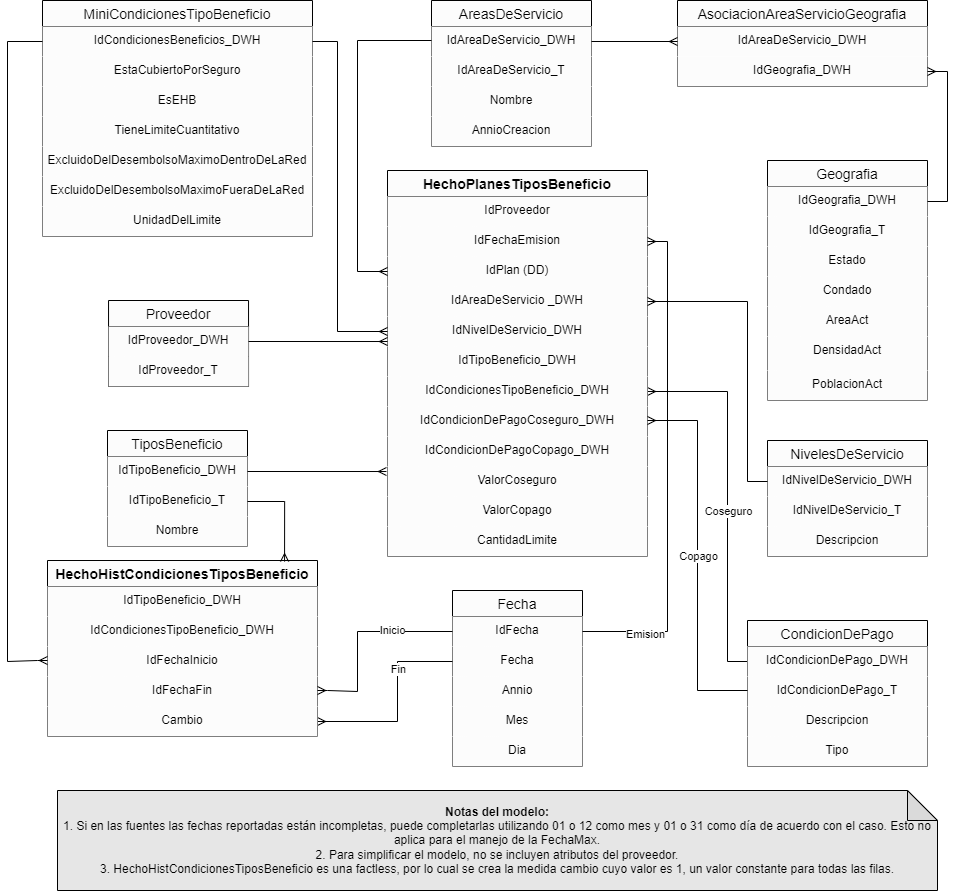

# **Construir un proceso ETL**
## **Objetivo**
- Implementar el proceso ETL del proyecto.  
## **Instrucciones**

En esta fase del proyecto, a partir de la capacitación recibida en los diferentes temas, algunos ejemplos de análisis requeridos, aclaraciones de la organización sobre los datos compartidos inicialmente y de un modelo multidimensional con manejo de historia propuesto, RaSA considera que están listos para realizar todo lo relacionado con el proceso de ETL. En particular requiere que trabajen en los siguientes entregables:

1. **Entregable 1 - Diseño del ETL:** Incluir el diseño ETL propuesto para poblar las tablas asociadas al modelo multidimensional dado, utilizando como fuentes, las compartidas. Esto incluye manejo de historia. Recuerde incluir la descripción del diseño y utilizar esta [plantilla](PlantillaDiseñoETL.xlsx).
2. **Entregable 2 - Implementación del ETL:** implementación del proceso ETL de las dimensiones y tabla de hechos del proyecto incluyendo manejo de historia.  Recuerde incluir la descripción del proceso de implementación.

A nivel de trabajo en grupo, dada la experiencia que la empresa tiene en este estilo de proyectos, le sugiere lo siguiente:
- Cada miembro del grupo se haga responsable de una dimensión o de dos si la dimensión es básica.
- Definan de forma conjunta el proceso a seguir para las transformaciones y cargue de la tabla de hechos
- El miembro con las dimensiones más sencillas o el menor número de dimensiones asignadas trabaje la tabla de hechos. 

## **Recursos requeridos**
***Datos suministrados***

Los datos los puede encontrar en la base de datos: RasaTransaccional_ETL del servidor que manejamos en los tutoriales. También puede encontrar el diccionario de los mismos [aquí](Diccionario%20I.xlsx), ambos recursos requeridos para el desarrollo de esta tarea. Las tablas son copias de las tablas fuente del proceso que se está analizando. 
Recuerde que los datos que se usaron para el entendimiento de datos tienen como sufijo Copia (e.g., BeneficiosCopia), en caso de que deseen repasar o rehacer el ejercicio de Entendimiento de datos. 
Los datos revisados por RaSA a partir de los resultados y/o conclusiones que obtuvieron en la etapa de entenimiento de datos y que deben ser utilizados en el proceso de ETL quedan en las tablas:
- F1: AreasDeServicio
- F2: Beneficios
- F3: BeneficiosPlanes
- F4: NivelDeRed y CondicionesDePago 

En el proceso de carga, para manejar atributos tipo fecha, si el atributo no tiene día o mes, asuma como valores por defecto el primer día del mes, y el primer mes de cada año.

***Respuestas del negocio a conclusiones de Entendimiento***

Después de hacer una revisión a las fuentes que fueron inicialmente proporcionadas, gracias a sus comentarios y preguntas, encontramos los siguientes errores relacionados con las reglas de negocio que les compartimos:

1.	Las áreas de servicio NO cubren todos los condados del país.
2.	No fue posible validar la condición de límites cuantitativos, así que, si se evidencia límites cuantitativos sin valor o con un valor en cero, en los planes que los ofrecen, debe colocar como valor por defecto 333 para poder identificar el error y corregirlo en el futuro.
3.	Se corrigió la fecha de 1800 que estaba en la fuente de áreas de servicio.
4.	La fuente de áreas de servicio tenía información solo de los años 2017 y 2018 y faltaba todo el año 2019. 
5.	En la fuente de tipos de beneficios no deberían existir diferentes condiciones y unidad de límite para el mismo tipo de beneficio en el mismo año. Esto fue arreglado y solo debe existir un valor de condiciones y unidad límite de tipo de beneficio por año.
6.	El valor máximo Copago y Coseguro para el año 2018 es 3500 y 100 respectivamente.
7.	En la fuente de condiciones de pago se eliminaron los registros con el mismo tipo y descripción que tenía diferentes identificadores.

RaSa también le comenta que:

1.	En la fuente de planes beneficio
a.	Se corrigieron los registros que tenían valores nulos en IdPlan, IdTipoBeneficio o IdAreaDeServicio. 
b.	Se eliminaron los registros con IdTipoBeneficio que no estaban en la fuente de Tipos de Beneficios. Sin embargo, todavía existen IdAreaDeServicio que no están presentes en la fuente correspondiente, por lo que se le recomienda crear un registro de desconocido (Identificador=0) y NO omitir esta información en el proceso de carga. 
c.	Finalmente, las fechas inválidas fueron actualizadas, pero todavía existen fechas con otro tipo de formato y se le pide que las transforme para que todas queden con formato YYYY-MM-DD.

2.	En la fuente de tipos de beneficio
a.	Se corrigieron los registros con diferentes unidades de límites para el mismo beneficio en el mismo año. 
b.	Sin embargo, siguen existiendo errores de consistencia en los valores de las condiciones, se le pide cambiar los diferentes valores para que queden únicamente “Yes” y “No”.

3.	En la fuente de áreas de servicio
a.	Se eliminaron los registros con diferentes IdGeografia cuyo contenido en los demás atributos era el mismo. 
b.	Se corrigieron los registros con IdAreaDeServicio e IdGeografia nulos. 
c.	Las fechas erróneas fueron actualizadas por las correctas. 
d.	Se le pide corregir los registros con áreas negativas, multiplicando por -1 esos valores.
e.	Finalmente, los que presentan un error de digitación en la población actual con 3 ceros y un uno al final del número (0001) debe corregirlos y quitarles estos últimos 4 dígitos, de tal forma que si el valor era 27540001 debe quedar 2754.

4.	En la fuente de condiciones de pago
a.	Se actualizaron los registros con tipo NaN 
b.	Sin embargo, siguen existiendo errores de consistencia, se le pide corregir el tipo a solo Copago y Coseguro.
5.	Puede que existan todavía duplicados de los registros en las fuentes, por favor revisar y eliminarlos.
6.	Estaremos atentos si quedaron preguntas sin contestar para hacerlo en la menor brevedad.

***Modelo multidimensional propuesto*** 

El modelo propuesto contiene dos tablas de Hechos. La primera de ellas, la de **HechoPlanesTiposBeneficio** registra la emisión de planes, en una fecha, en la cual se definen los tipos de beneficios, sus condiciones, el área de servicio al que aplica el tipo beneficio, las condiciones del pago de Coseguro y Copago y como medidas los valores de copago, coseguro y la cantidad límite del tipo de beneficio. Adicionalmente, para el manejo de historia de cambios a nivel de las condiciones de tipo beneficio, se propone un tipo 4, en el cual se crea la minidimensión **MiniCondicionesTipoBeneficio** y para el registro de la historia de cambios se tiene la factless **HechoHistCondicionesTiposBeneficio**. Dado que se trata de una factless, se adiciona la medida Cambio, la cual tendrá un valor constante de 1 para todas las filas. A nivel de la dimensión Proveedor, solo se tendrán los identificadores, a pesar de que dicha dimensión tiene otros atributos. Esto por razones de simplificación del caso.

***Tecnología***

Recuerden que están los tutoriales "Proceso ETL" y "Proceso ETL Incremental"

## **Recomendaciones de los entregables**
* Seguir las indicaciones del tutorial de ETL
* Ser cuidadosos al momento de cargar la tabla de hechos

## **Preguntas o más información**
- Si el cargue de datos con la función <i>guardar_db()</i> se demora, hacer uso del código de cargue por lotes que encuentra en el Tutorial de ETL al final del bloque 6: Hecho orden
- Recuerde que puede hacer reemplazos de cadenas de caracteres haciendo uso de diccionarios, puede encontrar ejemplos en el siguiente enlace: https://sparkbyexamples.com/pyspark/pyspark-replace-column-values/
- Las preguntas que surjan en el desarrollo de esta tarea pueden registrarlas en el slack del curso

